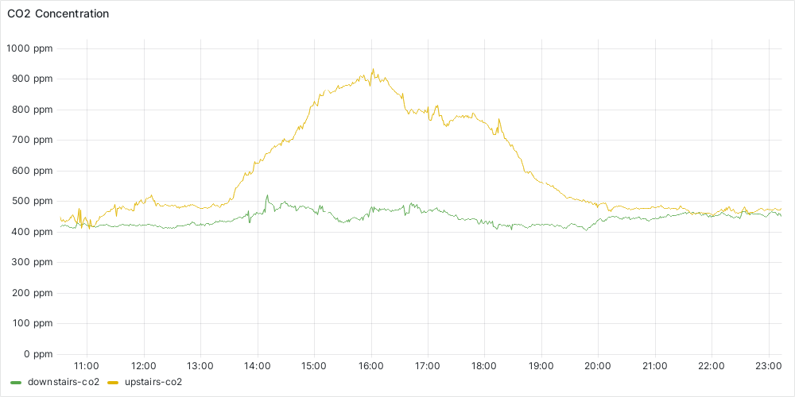
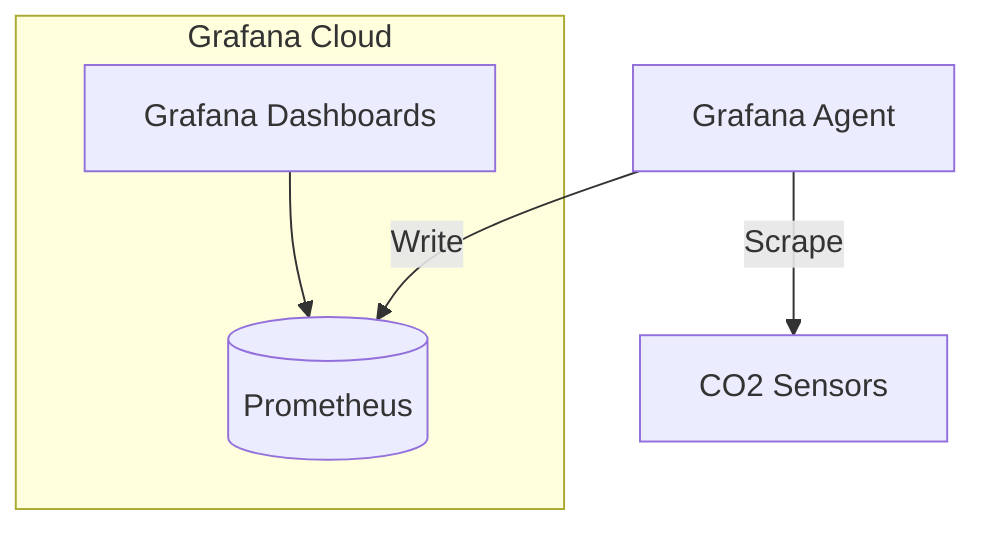
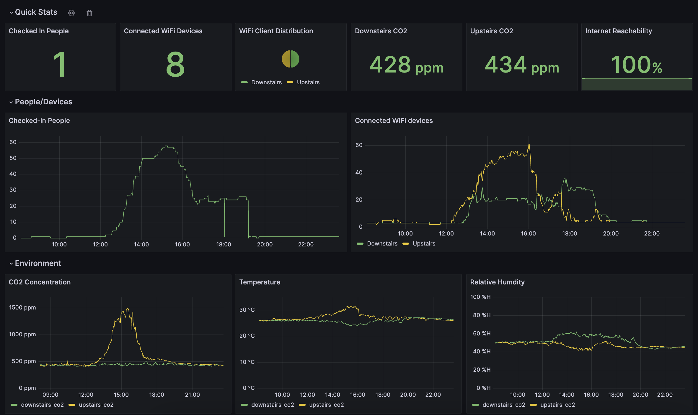

# co2-monitoring
A collection of configs used to monitor indoor CO2 levels at The Forge

# Background
One of the many challenges of running an open innovation tech space amidst a global pandemic was safety of our members and guests. One layer of our approach was enhancing ventilation to lower risk of exposure to airborne pathogens. While there's no practical way to measure the viral load of our air, we decided to use CO2 levels as a metric for how well we are ventilating our indoor spaces. This is more challenging in some of our spaces than others.

# Architecture Overview
As an open innovation tech space, we of course relied on technology to help us tackle this observability problem. We used open source tooling like [Prometheus](https://prometheus.io/) and [Grafana](https://grafana.com/) which are standard tools in the tech industry for collecting and visualizing time series data.

We used a Grafana agent running on a Raspberry Pi to scrape CO2 data samples and store them in Grafana Cloud where we created dashboards to visualize the data.

# Sensors
Due to several members tackling this problem unbeknownst to each other, we ended up having 2 flavors of CO2 sensor hardware.

## ESP8266-based
The first flavor used some ESP8266 dev boards from a member's junk drawer and some [SCD-30](https://www.adafruit.com/product/4867) sensors from Adafruit.

ESP8266s and ESP32s are wildly popular for home automation projects, so we took advantage of the [ESPHome](https://esphome.io/) project which already had components for [reading from the SCD-30 sensor](https://esphome.io/components/sensor/scd30.html?highlight=scd30) and [exposing a Prometheus metrics endpoint](https://esphome.io/components/prometheus.html)

A [sanitized ESPHome config](esphome-co2.yml) shows our configuration for both of those components.

## Raspberry Pi-based
The other flavor of sensor used a Raspberry Pi Zero W and [Adafruit SGP30](https://www.adafruit.com/product/3709) VOC/eCO2 sensor.

Loosely based on an [Adafruit guide](https://learn.adafruit.com/adafruit-io-air-quality-monitor?view=all#python-wiring-and-assembly), we wrote a small Python app to read sensor data and expose it via the Prometheus metrics format.

# Metric Collection
With a handful of CO2 sensors exposing data in the Prometheus format, we were ready to start scraping metrics and writing them to Grafana Cloud. On a Raspberry Pi we had on hand, we configured [static scrape configs](grafana-agent.yml) to point the [Grafana agent](https://github.com/grafana/agent) to each of our sensors.

# Visualization
To wrap it up, we created a dashboard to visualize the environmental data we collected from our sensors. Data is addicting, so we incorporated some other useful metrics like the number of people checked-in to our space and devices connected to our WiFi.

